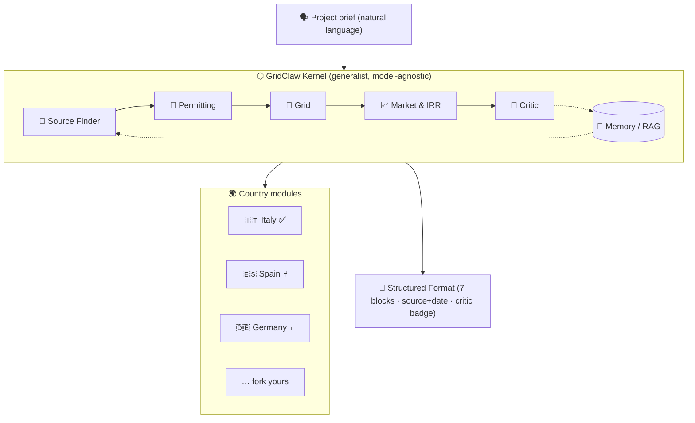

<div align="center">

# ⬡ GridClaw

### The open-source engine that **understands**, **learns** and **acts** on energy — in any country.

[](LICENSE)
[](modules/italy)
[](#model-agnostic)
[](#-fork-your-country)

> **The bottleneck of the AI era is not the chip — it's permitting and grid connection. We're opening it up.**

</div>

---

## The thesis

Data centers, electrification and storage are no longer blocked by silicon. They're blocked at the **interconnection queue** and the **authorization desk**. Every country has its own regulator, its own grid operator, its own permitting maze and its own market schemes — written in its own language, scattered across PDFs, portals and case law.

**GridClaw turns the world's energy rulebooks into something an AI agent can read, reason over, and act on.** It's a generalist engine that, in any country, knows *where* to get the information, *learns* it, and then *acts* on it — feasibility, permitting path, grid status, and a **real IRR**.

It is built to be **forked**: a generalist kernel plus one module per country. Italy is the reference module, written by a renewable-energy developer with a ~100 MW BESS pipeline in Campania.

---

## What it does

Describe a project in plain language:

```
BESS 100MW / 400MWh in Vallo della Lucania, Campania — is it feasible and what's the IRR?
```

A multi-agent swarm goes to work:

| Agent | Role |
|---|---|
| 🧭 **Source Finder** | Finds the regulator, TSO/DSO, ministry, tenders and the statutes that govern the project |
| 📜 **Permitting** | Classifies the authorization iter (Autorizzazione Unica / PAUR), authority, timeline, VIA triggers |
| 🔌 **Grid** | Connection status, voltage, queue, and whether a binding **STMG** is required |
| 📈 **Market & IRR** | Revenue scheme (MACSE / capacity / merchant) and a **real, code-computed IRR** + scenario comparison |
| 🧪 **Critic** | Temporal validity check on norms, **independent IRR recompute**, source presence check |

…and returns a structured **Format** with seven blocks — every field carrying a **source + date** for full transparency, and each block flagged `Critic verified ✓` or `⚠️ needs human`.

> **The reasoning layer is mocked so the demo runs offline with zero API keys.** The IRR is **not** mocked — it's computed by a real bisection solver in [`site/engine.js`](site/engine.js).

### The 7-block Format

1. **Lifecycle State** — greenfield / brownfield / RTB / NTP / COD / revamping → determines the interlocutor
2. **Identity** — tech, MW, MWh, location, coordinates
3. **Area & Constraints** — landscape / hydrogeological / distance-to-substation, screened from coordinates
4. **Permitting** — iter, competent authority, status, estimated months, *living norms* (laws + rulings via RAG)
5. **Grid** — operator, connection request status (STMG), capacity/queue, voltage
6. **Market & Finance** — scheme, revenue, **real IRR/NPV/payback**, three-scenario comparison
7. **Interlocutor / Match** — who to contact, based on the lifecycle state

---

## Architecture



The **kernel** is generalist: orchestration, source-finding, RAG, the IRR engine and the critic. The **country module** supplies the local truth — authorities, schemes, permitting iters, living norms, and a coordinate→constraint screen.

```
gridclaw/
├─ site/                 # the live demo (offline, no API key)
│  ├─ index.html
│  ├─ engine.js          # ⚙️ mock reasoning + REAL IRR/NPV engine
│  ├─ app.js             # swarm animation + Format renderer
│  └─ styles.css
├─ modules/
│  ├─ italy/             # ✅ reference module
│  │  ├─ module.json     # authorities, schemes, permitting, living norms
│  │  ├─ constraints.js  # coordinate → landscape/hydro/substation screen
│  │  └─ README.md
│  └─ _template/         # ⑂ copy this to start a new country
│     └─ module.json
├─ format/
│  └─ project.schema.json  # JSON Schema for the 7-block Format
├─ LICENSE               # AGPL-3.0
└─ README.md
```

---

## <a name="model-agnostic"></a>Model-agnostic

GridClaw is glue + domain knowledge, not a model. It runs in two modes:

- **Offline** (zero keys): a deterministic engine in [`site/engine.js`](site/engine.js) with **real IRR/NPV math** and the Italy ground-truth module. The site is always usable.
- **Live** (add keys): a Node backend runs the **Trinity** swarm — Claude + GPT + DeepSeek answer in parallel, then **cross-critique each other**, then a judge **fuses** one reconciled answer. The Source Finder does **real web search** with citations; the numbers stay deterministic (the LLMs interpret them, they never invent them).

No model is privileged — add one key or all three. See [Go live](#go-live) below.

---

## The open engine stack

We **orchestrate the world's best open engines instead of reinventing them.** GridClaw composes:

| Layer | What we use | Open projects |
|---|---|---|
| **Orchestration** | LangGraph-style stateful multi-agent graph | [MetaGPT](https://github.com/geekan/MetaGPT) · [OpenManus](https://github.com/FoundationAgents/OpenManus) · [CAMEL](https://github.com/camel-ai/camel) |
| **Deep research** (Source Finder) | Autonomous, citing web research | [MindSearch](https://github.com/InternLM/MindSearch) · [Alibaba DeepResearch](https://github.com/Alibaba-NLP/DeepResearch) · [open_deep_research](https://github.com/langchain-ai/open_deep_research) |
| **Swarm simulation** | Multi-scenario stress-testing | [MiroFish](https://github.com/666ghj/MiroFish) |
| **Living norms** | Legal RAG with temporal checks | [LawGlance](https://github.com/lawglance/lawglance) |

---

## 🌍 Fork your country

Italy is the reference. Adding a country is three files:

```bash
# 1. copy the template
cp -r modules/_template modules/spain

# 2. fill modules/spain/module.json
#    → regulator, TSO/DSO, ministry, incentive agency
#    → schemes (capacity market, auctions, merchant)
#    → permitting iters + competent authorities + typical months
#    → refNorms (laws + rulings) with source + date
#    → a coordinate→constraint screen (constraints.js)

# 3. open a PR — the kernel auto-registers the module by ISO code
```

Start from [`modules/italy/module.json`](modules/italy/module.json) — it's the most complete example. Keep every field's `source` and `date` honest; the Critic agent depends on it.

**Wanted modules:** 🇪🇸 Spain · 🇩🇪 Germany · 🇬🇷 Greece · 🇫🇷 France · 🇬🇧 UK · 🇵🇹 Portugal · 🇺🇸 USA · and yours.

---

## Run the demo

```bash
git clone https://github.com/felicelucia/gridclaw
cd gridclaw/site
python3 -m http.server 8099
# open http://localhost:8099
```

No build step, no API key. The IRR is computed live in your browser.

To verify the finance core directly:

```bash
node -e "global.window=global; require('./site/engine.js');
  const r = GridClaw.analyze('BESS 100MW / 400MWh Vallo della Lucania');
  console.log(r.format.block6_finance.projectIRRpct, r.format.block6_finance.equityIRRpct);"
```

---

## <a name="go-live"></a>Go live (the Trinity engine)

Turn the demo into a real, reasoning engine in ~30 seconds.

```bash
git clone https://github.com/felicelucia/gridclaw
cd gridclaw
npm install
cp .env.example .env        # paste your keys into .env
npm run dev                 # → http://localhost:8099
```

Then open `http://localhost:8099`. The status badge flips from **“running offline”** to **“LIVE · Claude + GPT + DeepSeek · cross-critique on · real web search”** automatically.

### Keys (all optional, all in `.env`)

| Variable | Unlocks |
|---|---|
| `ANTHROPIC_API_KEY` | Claude as a reasoning model |
| `OPENAI_API_KEY` | GPT as a reasoning model |
| `DEEPSEEK_API_KEY` | DeepSeek as a reasoning model |
| `PERPLEXITY_API_KEY` | **Real web search** with citations in the Source Finder |

- **1 key** → the swarm reasons live with that model.
- **2+ keys** → **Trinity cross-critique** activates: models review each other and a judge fuses the result.
- **0 keys** → the site still works, fully offline, with real IRR.

Keys are read from the environment only and never reach the browser. `.env` is git-ignored.

### How the live engine is wired

```
server/
├─ providers.js   # uniform adapter over Claude · GPT · DeepSeek + Perplexity web search
├─ trinity.js     # draft (parallel) → cross-critique → fuse  (the multi-model council)
├─ agents.js      # Source Finder (web) → Permitting → Grid → Market&IRR (real math) → Critic
└─ index.js       # Express: serves the site + /api/status + /api/run (SSE stream)
```

The front-end calls `GET /api/status` on load to detect live mode, then streams the real swarm reasoning from `GET /api/run` over Server-Sent Events. Any live failure degrades gracefully back to the offline engine.

---

## Monetization

The engine is **open and free forever** (AGPL-3.0). We monetize tastefully at the point value becomes real:

- **Open Engine** — €0, self-hosted, bring your own LLM key.
- **Human Handoff** (freemium) — you pay only when an analysis hits a `⚠️ needs human` gate: STMG/permitting expert review, verified constraint screening, counterparty introduction.
- **Country Customization** — consulting to build & maintain a country module, private data integrations, bespoke market models.

---

## Roadmap → the 2028 open standard for energy

- [x] **v0** — Italy reference module, real IRR engine, swarm demo, common Format
- [ ] **v0.2** — live LLM backends (Claude/GPT/DeepSeek), persistent RAG store
- [ ] **v0.3** — 5 country modules, real STMG/grid-map connectors
- [ ] **v0.5** — automated tender ingestion, counterparty graph
- [ ] **v1.0** — 20+ countries, contributor governance
- [ ] **2028** — the open standard every developer, fund and EPC uses to read the grid

---

## Disclaimer

GridClaw is a decision-support tool, **not legal, financial or engineering advice**. Norms and market data change; always confirm with the competent authority, the grid operator's STMG, and qualified advisors. The demo's reasoning layer is simulated; outputs are illustrative.

## License

[GNU AGPL-3.0](LICENSE). If you run a modified version as a network service, you must publish your source. Energy infrastructure should be transparent.
